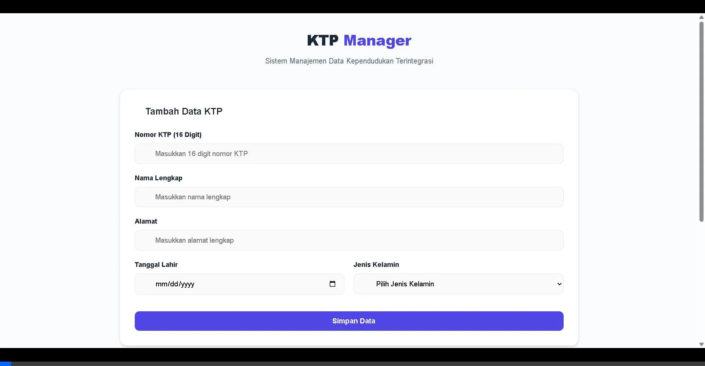
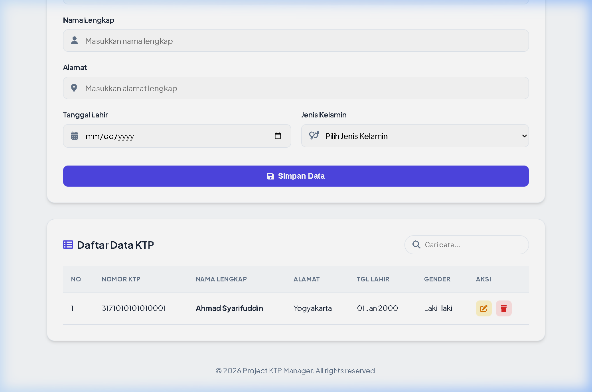

# Dokumentasi API - KTP Management

Aplikasi KTP Management ini dibangun menggunakan Spring Boot (Backend) dan HTML/jQuery AJAX (Frontend). Berikut adalah dokumentasi API yang digunakan beserta tampilan antarmuka webnya.



## Tampilan Web dengan Data


---

## Dokumentasi REST API

Base URL untuk semua endpoint adalah: `http://localhost:8080/ktp`

### 1. Menambah Data KTP Baru
* **URL:** `/ktp`
* **Method:** `POST`
* **Body (JSON):**
  ```json
  {
    "nomorKtp": "3171234567890123",
    "namaLengkap": "Budi Santoso",
    "alamat": "Jl. Mawar No. 12",
    "tanggalLahir": "1995-08-17",
    "jenisKelamin": "Laki-laki"
  }
  ```
* **Success Response:** `201 Created`
* **Error Response:** `400 Bad Request` (Jika nomor KTP sudah terdaftar atau input tidak valid).

### 2. Mengambil Seluruh Data KTP
* **URL:** `/ktp`
* **Method:** `GET`
* **Success Response:** `200 OK` (Mengembalikan array dari object data KTP).

### 3. Mengambil Data KTP Spesifik
* **URL:** `/ktp/{id}`
* **Method:** `GET`
* **URL Params:** `id=[Integer]`
* **Success Response:** `200 OK`
* **Error Response:** `404 Not Found` (Jika ID tidak ada di database).

### 4. Memperbarui Data KTP
* **URL:** `/ktp/{id}`
* **Method:** `PUT`
* **URL Params:** `id=[Integer]`
* **Body (JSON):** Sama seperti pada proses POST.
* **Success Response:** `200 OK`
* **Error Response:** `404 Not Found` atau `400 Bad Request`.

### 5. Menghapus Data KTP
* **URL:** `/ktp/{id}`
* **Method:** `DELETE`
* **URL Params:** `id=[Integer]`
* **Success Response:** `204 No Content`
* **Error Response:** `404 Not Found`.
